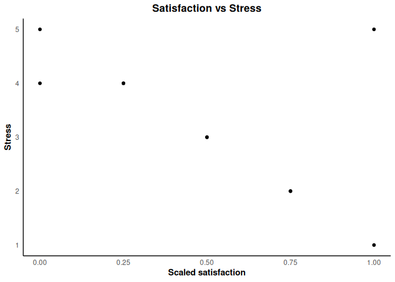

# Psych Tools

The goal of this package is to provide convenient tools for psychology
survey data processing and APA-style visualizations.

## Installation

You can install the development version from
[GitHub](https://github.com/) with:

``` r
# install.packages("pak")
pak::pak("ADC-405-S26/Pyo_project4")
```

## Example

This is a basic example which shows you how to scale survey responses
and use the custom APA theme:

``` r
library(project)
data(survey_demo)

# 1. Scale satisfaction scores (1-5 Likert to 0-1)
survey_demo$scaled_sat <- scale_responses(survey_demo$satisfaction)
head(survey_demo[, c("id", "satisfaction", "scaled_sat")])
#>   id satisfaction scaled_sat
#> 1  1            1       0.00
#> 2  2            3       0.50
#> 3  3            4       0.75
#> 4  4            5       1.00
#> 5  5            2       0.25
#> 6  6            3       0.50
```

``` r
library(ggplot2)

# 2. Simple APA-style plot
ggplot(survey_demo, aes(x = scaled_sat, y = stress)) +
  geom_point() +
  labs(title = "Satisfaction vs Stress",
       x = "Scaled satisfaction",
       y = "Stress") +
  theme_apa()
```


