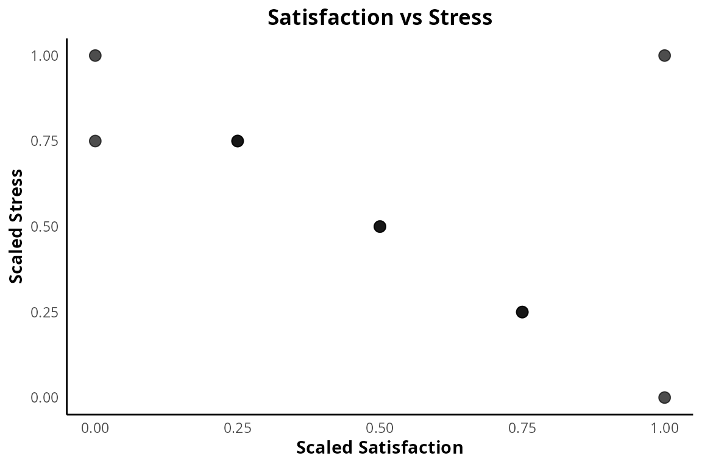

# Psych Tools

## Introduction

This package helps you clean raw psychology survey data and create
APA-style plots for research papers.

## Loading the package and data

First, we load the package and the built-in toy dataset (survey_demo).

``` r
library(project)
data(survey_demo)
head(survey_demo)
#>   id satisfaction stress                    tags
#> 1  1            1      4     anxiety, depression
#> 2  2            3      3         stress, fatigue
#> 3  3            4      2 happiness, satisfaction
#> 4  4            5      5                 anxiety
#> 5  5            2      4         fatigue, stress
#> 6  6            3      3                lethargy
```

## 1. Scaling Likert Responses

We scale the 1-5 Likert responses for satisfaction and stress into a 0
to 1 range.

``` r
survey_demo$satisfaction_scaled <- scale_responses(survey_demo$satisfaction)
survey_demo$stress_scaled <- scale_responses(survey_demo$stress)
```

## 2. Working with Keyword Tags

We split the comma-separated keyword tags from the open-ended responses
into a clean list.

``` r
kw <- split_keywords(survey_demo$tags)
str(kw)
#> List of 10
#>  $ : chr [1:2] "anxiety" "depression"
#>  $ : chr [1:2] "stress" "fatigue"
#>  $ : chr [1:2] "happiness" "satisfaction"
#>  $ : chr "anxiety"
#>  $ : chr [1:2] "fatigue" "stress"
#>  $ : chr "lethargy"
#>  $ : chr "happiness"
#>  $ : chr [1:2] "satisfaction" "stability"
#>  $ : chr "depression"
#>  $ : chr [1:2] "fatigue" "lethargy"
```

## 3. Creating APA-style Plots

We create a scatter plot with the scaled scores and apply our custom APA
theme.

``` r
library(ggplot2)
ggplot(survey_demo, aes(x = satisfaction_scaled, y = stress_scaled)) +
  geom_point(size = 3, alpha = 0.7) +
  labs(title = "Satisfaction vs Stress", x = "Scaled Satisfaction", y = "Scaled Stress") +
  theme_apa()
```


